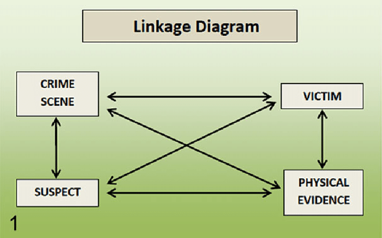

在我们处理业务安全问题的过程中，其实始终会面对如何“收集证据”和“量刑定罪”的问题。合理的证据和定罪一方面让我们的动作更有依据，当受到来用户、业务侧和领导的压力时，让能风控团队能从容地对外解释；另一方面，也能对内形成规范，让大家对能不能处罚、如何处罚形成统一的规范。讲到“证据”和“定罪”，很自然联想到我们社会中最大规模的“证据”和“定罪”事件：民事诉讼和刑事诉讼。我在这个文章里，分析一下业务安全治理中的定罪与民事/刑事诉讼过程中的定罪之间的关系，同时介绍几个在民事/刑事定罪中重要理念（高度盖然、优势证据、排除合理怀疑），以及几种常见的证据类型，最后总结下在业务安全问题中做定罪的思路。<!--more-->

## 民事判罚、刑事判罚和业务安全中的判罚
业务安全中的判罚与民事判罚更接近，还是与刑事判罚更接近？互相之间有什么相似性和区别？本节主要想回答这个问题。

|        |  业务安全  |  刑事  |  民事  |
|  ----  | ----      | ----  |  ----  |
| “诉讼”主体  | 业务安全部门 | 政府机构 | 个人 |
| “诉讼”目的  | 维护业务生态 | 追求刑事责任，维护社会安定 | 解决私人纠纷，经济&合同 |
| 证据标准  | 不同阶段不同，一般需要非常有说服力 | 非常有说服力 | 足够有说服力 |
| 判决结果  | 账号处罚：封禁、限制等 | 有期徒刑、无期徒刑、缓刑、管制、拘役、罚金等 | 赔偿、赔付、补偿 |
| “诉讼”程序  | 安全部门下发；不服申诉 | 大陆法系：法官，英美法系：法官&陪审团；不服上诉 | 法官独立完成；不服上诉 |

从上表来看，业务安全处理的事情虽然在现实社会中看来是鸡毛蒜皮般的小事，跟刑事案件的严重程度上天差地别，但在诉讼主体、目的、证据标准、判决结果方面都有很强近似性，与民事诉讼反而差别较大。以此为出发点， 我们想进一步探讨：刑事诉讼和民事诉讼中判罚的核心理念都有哪些？都有哪些证据类型？

##  民事案件和刑事案件中定罪的核心理念
从上面的分析看，刑事案件的定罪思路可能更有借鉴意义，我们先深入了解下刑事定罪中的核心理念和常用证据类型，然后再补充一些民事判罚的视角。

### 刑事判决中的排除合理怀疑
我国于2012年修订、2013年实施的新《刑事诉讼法》中正式引入“排除合理怀疑”的概念。
实际上，世界各国在刑事审判中，对于证据指向的待证事实，还有可能出现的其他一些合理证据，又或者可能产生的其他合理怀疑，那么这些证据就不能作为刑事案件的定案依据。因此，在刑事案件的审理中，法官只能追求客观真实，这也是“疑罪从无，宁纵勿枉”审判理念的体现。
解释“排除合理怀疑”的最好例子莫过于辛普森杀妻案，其中的关键证据“血手套”就没能通过排除合理怀疑的检验：辛普森带不上那个手套，而且发现手套的警员的人品存在问题。

什么样的怀疑算事合理怀疑，什么样的不算？ 这是个即使专业法学家也感到头秃的事情。

### 几种常见的证据类型
在刑事案件判罚中，一般有以下几类证据：
1. 直接证据：指目击者对案件事实的直接证言或证物，如目击者证言、现场照片、录像等。
2. 间接证据：指不能直接证明案件事实的证据，但是与案件事实相关联，如证人证言、证人身份证明、鉴定报告等。
3. 前科证据：指被告人以前的犯罪记录或犯罪嫌疑，作为证明被告人犯罪的证据。
4. 物证证据：指从现场或犯罪嫌疑人身上发现的证据，如枪支、毒品、工具等。
5. 技术证据：指用科学技术所得的证据，如DNA鉴定、电子证据等。

从业务安全的视角出发，我尝试归纳各种类型的证据：
1. 直接证据：明确显现出来的内容证据，如不当言论、内容、用户名、个人资料等。
2. 间接证据：其他用户的举报；人机验证的结果；异常行为的判断。
3. 前科证据：用户或设备在过去发生过明确的违规行为记录。
4. 物证证据：工具上暴露出的问题，如设备、IP上的风险。
这样划分带来的一个好处是，各个证据来源之间是互相独立的，证据视角越多结论就越立得住脚。

### 犯人、物证、疑犯、现场交织成的证据链
在李昌钰的《[Henry Lee's Crime Scene Handbook]》一书中，提到的Evidence Linkage理论

### 民事判决中的高度盖然性 & 优势证据
回到“排除合理怀疑”中提到的辛普森案，辛普森在民事法庭中被判为有罪，就是基于“优势证据”的逻辑：被害人代表给出的证据比嫌疑人的反证更强有力，这就足够了。

##  民/刑事定罪对业务安全治理的启发 
1）即使是在后果极度严重的刑事案件定罪过程中，法官们对“排除合理怀疑”也没有一个定量的标准。在我们的工作力，反而有一些可以做量化的事情，比如某些定罪条件下用户的反馈情况，对业务的宏观影响情况等，这是我们的优势，应该充分利用。

2）对于一些非常严厉的处罚手段来说，坚持刑事判决中的“疑罪从无”原则是没有问题的：功利地说，如果按照LTV来计算，错误处罚一个用户平均带来的损失可能是几十上百元，更别说误伤到核心用户。但对于一些柔性的处罚，

总结来看，一个合理的定罪处罚流程，或许应该有如下几个部分组成：

[Henry Lee's Crime Scene Handbook]: https://book.douban.com/subject/1507415/